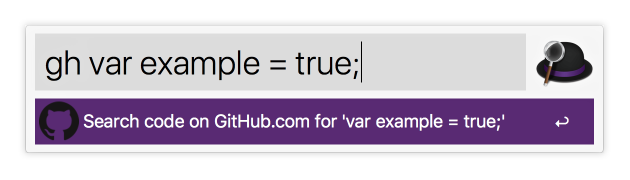

# Alfred Workflow for code search on GitHub.com
This workflow lets you search for code [GitHub.com](https://github.com) with
the query you input.




## Download and Install
Latest version: [v0.1.0](https://github.com/simeg/alfred-workflow-github.com/archive/master.zip)

1. Download the repository
2. Open `github_code_search.alfredworkflow` by double-clicking it or dragging
it into Alfred

## Usage
```
gh <search term>
```
The `<search term>` corresponds to what you would enter if you were searching for code on the GitHub website. After inputting a search term and pressing enter, a new tab in your default browser will open the result page on GitHub's website.

## License
(MIT) The license can be found in the [LICENSE](LICENSE.md) file.
